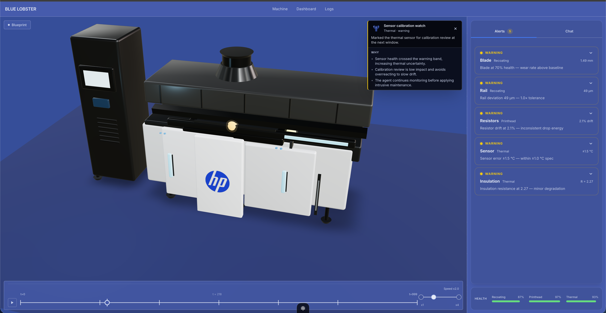
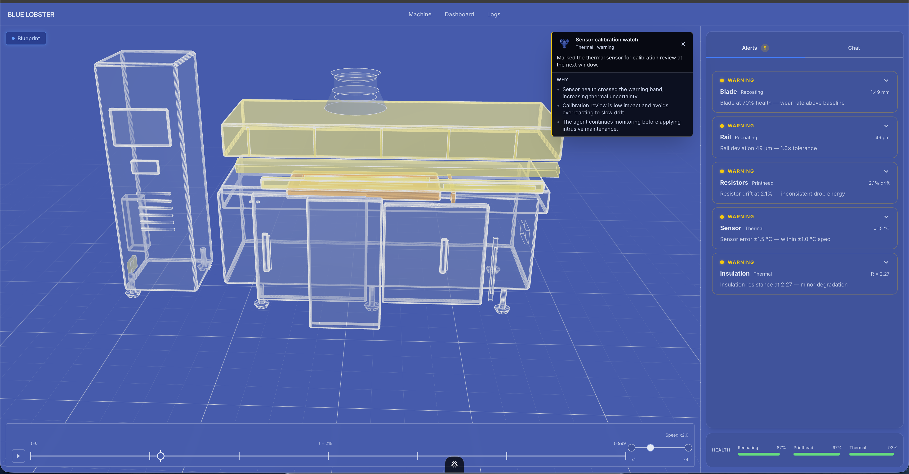
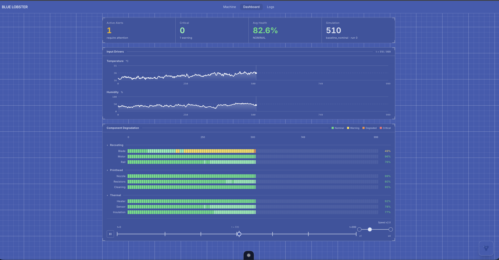

# Blue Lobster: HP Metal Jet S100 Digital Co-Pilot

Blue Lobster is a predictive maintenance and Digital Co-Pilot system for the HP Metal Jet S100 3D printer.
It combines a synthetic digital twin, reinforcement learning maintenance planning, telemetry dashboards, and an LLM-backed diagnostic assistant.

[Devpost: HackUPC 2026](https://hackupc-2026.devpost.com/)

## Product Preview



The main machine view combines the 3D digital twin, timeline scrubber, active warning stack, and co-pilot reasoning in one operator workspace.



The blueprint overlay exposes internal machine structure and highlights fault localization without leaving the live machine timeline.



The dashboard tracks active alerts, average health, input drivers, and component degradation across the simulated production run.

## System Architecture

The system is structured into three integrated layers.

### 1. Physics and Machine Learning (`/models/`, `/src/`)

Instead of relying on a physical machine, we built a digital twin that simulates the degradation of nine critical components across three subsystems.

* **Component models:** Deep learning models trained on synthetic data for components like the recoater blade, thermal resistors, and heating elements.
* **Reinforcement learning:** A Deep Q-Network agent learns maintenance strategies by balancing intervention costs against failure risks, outperforming fixed schedules in simulation.

### 2. Digital Co-Pilot Backend (`/backend/`)

A FastAPI application bridges the historian database and the AI co-pilot.

* **Grounded AI diagnostics:** Powered by Google Gemini, the agent is constrained through prompt engineering and SQLite tool-calling so answers are tied to explicit database ticks and run IDs.
* **Token compression:** Time-series telemetry is compressed with `pytoony` into a compact TOON representation before being sent to the model.

### 3. Interactive 3D Frontend (`/frontend/`)

A Next.js App Router and Tailwind CSS dashboard provides an industrial operator interface.

* **3D digital twin:** Built with React Three Fiber so users can scrub through time and inspect hardware failures on the model.
* **Telemetry dashboards:** Recoating, Printhead, and Thermal subsystems are tracked through health indicators, alerts, and degradation timelines.
* **Floating co-pilot:** The chat assistant understands the current timeline tick and explains machine state in context.

## Tech Stack

### Frontend

* **Framework:** Next.js 16 App Router
* **UI and styling:** React, Tailwind CSS v4, shadcn/ui, lucide-react
* **3D rendering:** Three.js, React Three Fiber, Drei
* **Runtime:** Bun

### Backend

* **API:** FastAPI, Uvicorn
* **Database:** SQLite3 in read-only mode for the AI agent
* **AI engine:** Google Gemini API, Anthropic API
* **Package management:** uv

### ML and Simulation

* **Frameworks:** PyTorch, NumPy
* **Techniques:** Deep Q-Network, tabular Q-learning, Weibull distribution modeling

## How to Run

### 1. Backend

Ensure you have `uv` installed.

```bash
cd backend
uv sync
uv run uvicorn main:app --reload
```

Do not run `precompute.py` unless you want to regenerate the synthetic `precomputed.json` database.

### 2. Frontend

Ensure you have `bun` installed.

```bash
cd frontend
bun install
bun --bun next dev
```

Open `http://localhost:3000` to view the 3D dashboard.

## Notes for AI Agents

If you are another AI agent analyzing this repo:

1. **Frontend caching:** The Next.js setup uses `"use client"` heavily due to fast-polling telemetry. Respect the `animTick` state when modifying views. Read `frontend/AGENTS.md` for Next.js 16 notes.
2. **Backend prompts:** The LLM instruction logic lives in `backend/info.md`. The backend database connection is strictly read-only.
3. **Strict typing:** The backend uses `pyright` and `ruff`. The frontend relies on strict TypeScript interfaces in `frontend/lib/api-types.ts`. Do not use `any`.
